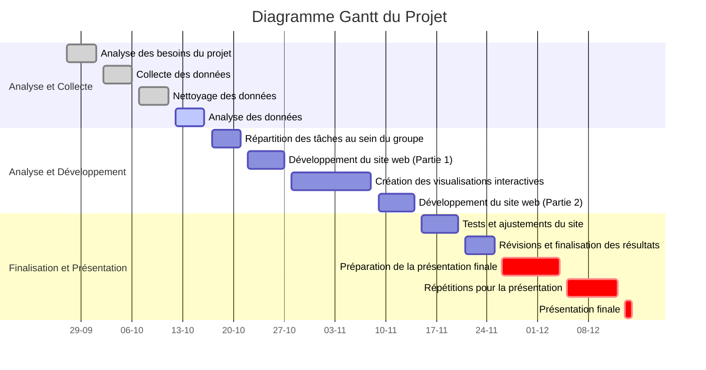

# Diagramme Gantt du Projet

```mermaid
gantt
    title Diagramme Gantt du Projet
    dateFormat  YYYY-MM-DD
    axisFormat  %d-%m
    section Analyse et Collecte
    Analyse des besoins du projet   :done,   des1, 2024-09-27, 2024-10-01
    Collecte des données     :done,   des2, 2024-10-02, 2024-10-06
    Nettoyage des données  :done,   des3, 2024-10-07, 2024-10-11
    Analyse des données                :active, des4, 2024-10-12, 2024-10-16
    section Analyse et Développement
    Répartition des tâches au sein du groupe :        des5, 2024-10-17, 2024-10-21
    Développement du site web (Partie 1) :        des6, 2024-10-22, 2024-10-27
    Création des visualisations interactives   :        des7, 2024-10-28, 2024-11-08
    Développement du site web (Partie 2) :        des9, 2024-11-09, 2024-11-14
    section Finalisation et Présentation
    Tests et ajustements du site         :        des10, 2024-11-15, 2024-11-20
    Révisions et finalisation des résultats:      des11, 2024-11-21, 2024-11-25
    Préparation de la présentation finale: crit,       des12, 2024-11-26, 2024-12-04
    Répétitions pour la présentation     :   crit,     des13, 2024-12-05, 2024-12-12
    Présentation finale                  :  crit,      des14, 2024-12-13, 1d
```
